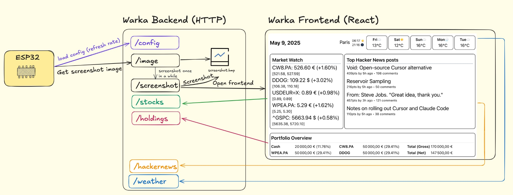

# Warka -- Backend

Warka Backend is a Flask API Server for the E-Ink Display Dashboard.
This backend serves various endpoints for a dashboard application displayed on an e-ink screen controlled by an ESP32.

Warka Backend handles screenshot generation, financial data, weather information, news feeds, and more.



## Features

- **Screenshot Generation**: Automatically captures screenshots of Warka frontend and converts it to BMP format
- **Financial Data**: Provides real-time stock prices and portfolio holdings information
- **Weather API**: Fetches current weather and forecasts
- **News Feed**: Retrieves top stories from Hacker News
- **Image Serving**: Serves BMP image data in chunks suitable for ESP32 transmission
- **Configuration Management**: Serves ESP32 configuration from JSON (`config.json`)

## Installation

1. Install dependencies:
   ```sh
   pip install -r requirements.txt
   ```
2. Download the chromedriver binary from https://googlechromelabs.github.io/chrome-for-testing/.

 Unzip and make sure to place the binary `chromedriver` under the `chromedriver` folder (Running `./chromedriver/chromedriver --version` should print the version). chromedriver is used in the headless browser to take the screenshot of the Warka frontend page.

3. Run the server:
   ```sh
   python server.py
   ```

## API Endpoints

The server listens on port `8000` and exposes the following endpoints:

### `/image`
Serves BMP image data as flattened pixel values for ESP32 consumption.

**Method:** GET
**Query Parameters:**
- `offset` (int, optional): Starting index for pixel data (default: 0)
- `limit` (int, optional): Number of bytes to return (default: 0, returns full remaining data)

**Response:** Plain text containing flattened pixel values from the BMP image.

**Note:** This endpoint randomly triggers screenshot updates (50% chance per call).

### `/screenshot`
Captures a screenshot of the frontend application and converts it to BMP format.

**Method:** GET
**Response:** 204 No Content on success, 500 on error

**Details:**
- Uses headless Chrome to capture a screenshot at 800x619 resolution
- Converts the screenshot to 1-bit monochrome BMP format suitable for e-ink displays
- Screenshots are saved as `screenshot.bmp`

### `/hackernews`
Fetches the top 4 stories from Hacker News.

**Method:** GET
**Response:** JSON array containing story objects with:
- `title`: Story headline
- `score`: Number of upvotes
- `time`: Unix timestamp
- `comments_count`: Number of comments

### `/stocks`
Retrieves real-time stock price information.

**Method:** GET
**Query Parameters:**
- `tickers` (string, required): Comma-separated list of stock symbols (e.g., "AAPL,MSFT,GOOGL")

**Response:** JSON object with ticker symbols as keys, each containing:
- `current_price`: Current stock price
- `delta_percentage`: Percentage change from previous day
- `day_low`: Day's lowest price
- `day_high`: Day's highest price
- `currency`: Price currency

### `/weather`
Provides weather forecast data for Paris.

**Method:** GET
**Response:** JSON object containing:
- `forecast`: Array of 8 days of weather data with temperature, status, and description
- `sunrise`: Sunrise time (HH:MM format)
- `sunset`: Sunset time (HH:MM format)

### `/holdings`
Returns personal portfolio information with current valuations.

**Method:** GET
**Response:** JSON object containing:
- `stocks`: Array of holdings with ticker, value, type, and percentage
- `total_value_gross`: Total portfolio value before taxes
- `total_value_approximation`: Estimated net value after taxes

### `/config`
Serves application configuration from `config.json`.

**Method:** GET
**Response:** JSON object containing configuration settings

## Configuration

### Environment Variables
- `OPENWEATHER_API_KEY`: API key for OpenWeatherMap (defaults to provided key if not set)

### Files
- `config.json`: ESP32 configuration file (screen refresh interval, etc...)
- `screenshot.bmp`: Generated screenshot in BMP format
- `chromedriver/chromedriver`: Chrome WebDriver executable

## Notes

- Define and adapt your portfolio holdings in `/holdings`
- Screenshots are automatically captured from `http://localhost:5173/` (expected frontend URL)
- Stock prices are fetched in real-time using Yahoo Finance API
- The `/image` endpoint implements chunked data transfer suitable for ESP32 memory constraints
- Financial calculations include currency conversion (USD to EUR) where applicable

## License

MIT License
