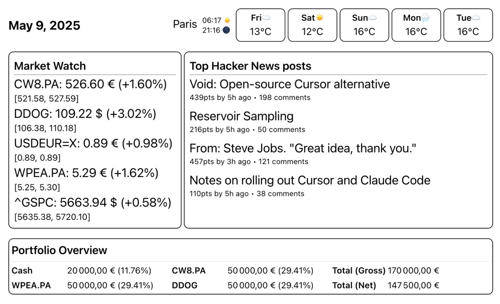

# 🚀 Warka -- Frontend

> **Your Personal Command Center for E-ink Displays**

This frontend is more than just a dashboard - it's a foundation for creating beautiful interfaces for e-ink displays.
Warka Frontend gives you the tools you need.

For the demo, we've built a sleek React dashboard that transforms your data into beautiful visualizations optimized for e-ink displays.
Track your investments, monitor weather, stay updated with news, and more - all in one elegant interface.



## ✨ What Makes It Special

🎯 **E-ink Optimized** - Crisp, high-contrast design perfect for low-power displays

📈 **Real-time Finance** - Live stock prices, portfolio tracking

🌤️ **Smart Weather** - multi-day forecasts with beautiful data visualization

📰 **Curated News** - Top stories from Hacker News at your fingertips

## 🚀 Quick Start

Get your dashboard running in a few seconds:

```bash
# Install dependencies
npm install

# Start development server
npm run dev

# Open http://localhost:5173 and watch the magic happen! ✨
```

## 📋 Available Scripts

```bash
npm run dev      # 🔥 Start development
npm run build    # 📦 Build for production
npm run preview  # 👀 Preview production build locally
npm run lint     # 🔍 Check code quality
```

## 🎨 Features Showcase

### 📊 **Financial Dashboard**
- Real-time stock prices with gains/losses
- Portfolio value tracking with percentage breakdowns
- Currency conversion and market indicators
- Clean, readable charts optimized for an e-ink display

### 🌍 **Weather Intelligence**
- Multi-day weather forecast with detailed metrics
- Sunrise/sunset times for perfect planning
- Temperature ranges and weather descriptions
- Beautiful weather icons and status indicators

### 📰 **News at a Glance**
- Top trending Hacker News stories
- Engagement metrics (scores, comments)
- Clean typography for easy reading
- Direct links to full articles

### 🔌 **ESP32 Integration Ready**
- Optimized for 800x480 e-ink displays
- Memory-efficient data transfer
- Battery-friendly update cycles

---

*Built with ❤️ for developers who appreciate beautiful, functional design*
